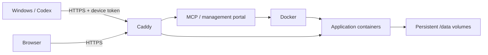

# local-sites

> Turn Codex into your private LAN app platform.

**Version 0.1 beta** — This project is still evolving and may change as it is improved.

[日本語 README](README.md)

local-sites is a self-hosted MCP server and Codex plugin for deploying and managing small web applications on an Ubuntu server inside your private LAN.

## What it provides

| Feature | Description |
| --- | --- |
| Application deployment | Source upload, Docker builds, readiness checks, redeployment, and fallback to the previous image after a failed update |
| Management portal | Browse, search, open, start, stop, inspect logs, delete, and permanently delete applications |
| Resource monitoring | CPU, memory, network traffic, storage usage, and seven-day history |
| Windows onboarding | Device enrollment and administrator approval, Codex plugin setup, reruns, and recovery |
| HTTPS | Caddy internal CA for the portal and deployed applications |
| Optional LAN DNS | Named application URLs, Windows DNS configuration, and restoration of previous settings |
| Development tools | Example notes app, packaging and upload utilities, and automated tests |



## Getting started

The detailed setup and operations guides are currently written in Japanese:

1. [Set up Ubuntu and establish the first administrator connection](docs/setup-ja.md)
2. Optionally [install LAN DNS](docs/lan-dns-ja.md)
3. [Add a Windows device and connect Codex](docs/windows-setup-ja.md)
4. Read about the [management portal](docs/portal-ja.md) and [MCP architecture](docs/mcp-learning-ja.md)
5. Follow the [operations, backup, and recovery guide](docs/operations-ja.md)

Start by copying `deploy/.env.example` to `deploy/.env`. The addresses `192.0.2.10` and `192.0.2.0/24` in the documentation are examples reserved for documentation; replace them with the actual server address and LAN subnet. No personal environment configuration is included in the repository.

## Requirements and limitations

The documented environment assumes Ubuntu 24.04 LTS, Docker Engine with the iptables backend, Docker Compose v2, Windows 11, Node.js 22 or later, Codex, and Windows tar. Node.js for the Ubuntu service is included in the container image.

local-sites is designed for a trusted administrator and trusted enrolled devices. Every enrolled device can manage every application. The manager has access to the Docker socket and host metrics, so it must not be used to execute untrusted Dockerfiles. It does not add authentication to deployed applications and is not intended to expose applications outside the LAN.

A normal delete preserves application data and the reserved URL. A permanent delete also removes the persistent volume. Updates briefly interrupt the manager, and database changes are not rolled back automatically. Build images and deployment history are not automatically pruned, and the portal does not provide a backup UI.

## Development and publication checks

```sh
npm ci
npm test
node scripts/check-publication.mjs
```

`npm start` listens on localhost port 3100 by default. Actual deployment requires Docker, and LAN access requires the configured Caddy gateway.

See the [verification scope](docs/verification-ja.md) and [publication security policy](docs/security-ja.md) for the tested and intentionally excluded material.

## License

Released under the [MIT License](LICENSE).
