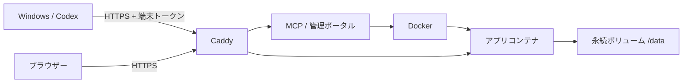

# local-sites

Codex から LAN 内の Ubuntu に小さな Web アプリを配置・管理する MCP サーバーとプラグインです。

## 提供するもの

| 機能 | 内容 |
| --- | --- |
| アプリ配置 | ソース転送、Docker ビルド、起動確認、再配置、失敗時の旧イメージ復帰 |
| 管理ポータル | 一覧、検索、URLコピー、起動・停止、ログ、通常削除・完全削除 |
| 利用状況 | CPU・メモリ・通信量・保存容量、過去7日間の履歴 |
| Windows導入 | 端末登録申請と管理者承認、Codexプラグイン設定、再実行・復旧 |
| HTTPS | Caddy内部CAによる管理画面とアプリのHTTPS |
| 任意のLAN DNS | 名前付きURL、WindowsのDNS設定と復元 |
| 開発用素材 | メモアプリ例、梱包・転送ツール、自動テスト |



## はじめる

1. [Ubuntuの初期構築と最初の接続](docs/setup-ja.md)
2. 必要な場合だけ [LAN DNSを導入](docs/lan-dns-ja.md)
3. [Windows端末を追加し、Codexから利用](docs/windows-setup-ja.md)
4. [管理ポータル](docs/portal-ja.md)・[MCPの仕組み](docs/mcp-learning-ja.md)
5. [運用・バックアップ・復旧](docs/operations-ja.md)

設定の入口は `deploy/.env.example` です。文書中の `192.0.2.10`、`192.0.2.0/24` は説明用です。実際のサーバーIPとLANに置き換えてください。個人環境の設定は含みません。

## 前提と制限

Ubuntu 24.04 LTS、Docker Engine（iptablesバックエンド）とCompose v2、Windows 11、Node.js 22以上、Codex、Windows tarを想定しています。Ubuntu側のNode.jsはコンテナに含まれます。

信頼する管理者とその端末向けです。登録端末は全アプリを管理できます。Dockerソケットとホスト情報へのアクセスを持ち、不特定ユーザーのDockerfileを実行するサービスではありません。アプリ自身の利用者認証は自動追加しません。LAN外への公開は対象外です。

通常削除はデータとURLを保持し、完全削除は保存ボリュームも削除します。更新中は短時間停止し、データベース変更は自動で戻りません。ビルドイメージと履歴の自動削除、バックアップUIはありません。

## 開発と公開確認

```sh
npm ci
npm test
node scripts/check-publication.mjs
```

`npm start` はlocalhost:3100で起動します。実際の配置にはDocker、公開アクセスには構成済みのCaddyが必要です。

[検証範囲](docs/verification-ja.md)と[公開時の情報管理](docs/security-ja.md)を参照してください。ライセンスは未設定です。
